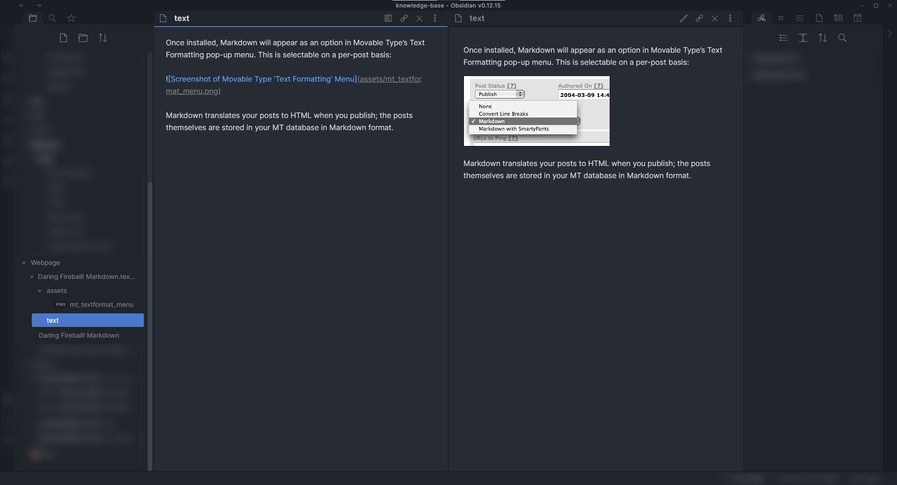

# Obsidian TextBundle Plugin
A plugin for [Obsidian](https://obsidian.md) to convert file to TextBundle and open TextBundle in Obsidian

## Usage
- `Convert to Textbundle` command in markdown file for generating TextBundle
- Click the TextBundle folder to open the `text.md`

## TODO
- Display the bundle title instead of `text`
- Supporting for textpack
